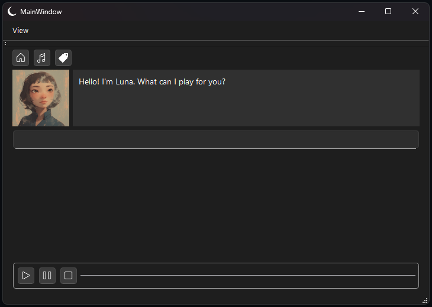

  

# Luna Lone

A local desktop application for organizing and playing audio usings tags and short prompts.

  

## Description

Luna Lone is a lightweight desktop application that lets you:

- Upload and organize audio files locally
- Assign reusable tags to audio clips
- Play audio based on tags or short text prompts
- Interact with a minimal, character-driven UI

All data is stored locally.

## Features

- 🎧 Local audio playback
- 🏷️ Tag-based audio organization
- 🔎 Prompt-based audio selection
- 🗂️ SQLite database

## Running the Application

1. Download the latest release from the Releases page
2. Extract the zip folder
3. Run `luna_lone.exe`

## Built With

- **C++17**
- **SQLite**
- **CMake**
- **Qt 6 (Widgets & Multimedia)**
- **MinGW (Windows)**

## Project Status

Luna Lone is an early-stage project

Planned improvements:
- Optimize UI colors for both dark theme and light theme
- Add UI volume control
- Improve prompt-to-tag matching
- Custom avatar selection
- Add support for short videos (gifs)
- Add voice lines for UI character
- Improve UI character's response

## License

This project is released under the MIT License.  
See the LICENSE file for details.

## Author

Created by Khemin Van Gestelen  
https://github.com/KheminVG
